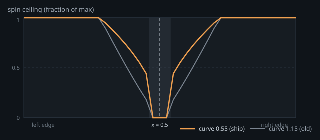
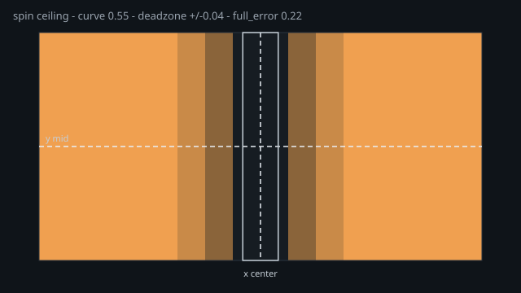
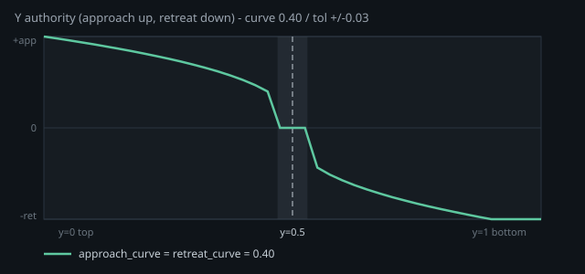
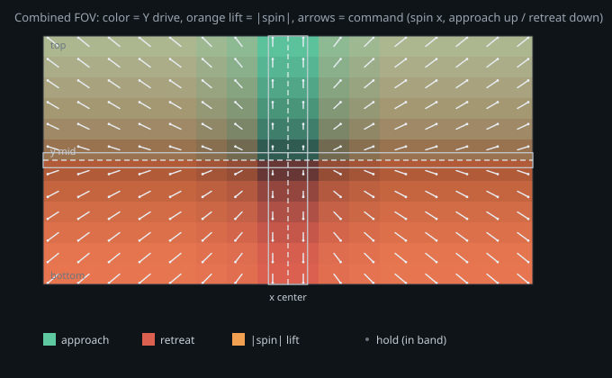

# Align authority curves (X + Y)

Spin and forward/back share the same power family:

\[
t = \min\!\left(1,\ \frac{|error|}{full}\right)^{curve}
\]

Regenerate figures after knob changes:

```powershell
python tools/gen_align_curve_svgs.py
```

## Lateral (X) — spin

| `align_spin_curve` | Shape | Feel |
| --- | --- | --- |
| `< 1` (ship: **0.55**) | concave-down | firm just outside deadzone |
| `= 1` | linear | proportional |
| `> 1` (old: 1.15) | ease-in | soft near center |

Deadzone: `|x − 0.5| ≤ horizontal_deadzone` → spin **0** (ship: **0.04**).





| Key | Ship | Role |
| --- | ---: | --- |
| `horizontal_deadzone` | 0.04 | no-spin band |
| `align_spin_full_error` | 0.22 | full spin ceiling |
| `align_spin_curve` | 0.55 | power |

## Vertical (Y) — approach / retreat

Same math via `_distance_axis`. Ship curves are tighter than X (short vertical FOV + camera tilted down). Grey band = hold (`± target_y_tolerance_ratio`). Above mid → approach; below → retreat.



| Key | Ship | Role |
| --- | ---: | --- |
| `target_y_tolerance_ratio` | 0.03 | Y hold band (±; exit = 2×) |
| `approach_curve` / `retreat_curve` | 0.40 / 0.40 | firmer than lateral |
| `max_retreat_axis` | 20000 | reverse when ball drops |
| `approach_near_cap_ratio` | 0.85 | soft-cap near band |

## Combined FOV (X + Y)

Color = Y drive (green approach / coral retreat). Orange lift = `|spin|`. Arrows = command vector (`spin` horizontal, approach up / retreat down on the page). Boxes = X deadzone + Y hold band. Cross = image center.



Hold cell (center): no arrow. Corner cells: spin + approach/retreat together (diagonal arrows).
