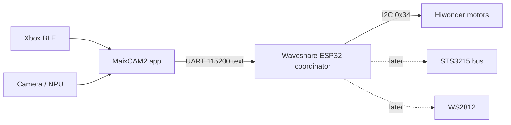

# Architecture

## Roles

| Node | Responsibility |
|------|----------------|
| **MaixCAM2** | Xbox, HUD, object detection, strategy, mecanum mix; sends wheel setpoints |
| **Waveshare ESP32** | Hardware coordinator: Hiwonder I2C, failsafe stop, OTA; later servos + LEDs |
| **Hiwonder** | 4 encoder motors only |

## Maix package (`maixcam/roverMecanum/`)

- Xbox / evdev / mapping / mixer / HUD: **keep**
- Direct `MaixI2cBus` → Hiwonder: **legacy** (replace with UART client to ESP)
- Config will grow a `uart` section; `i2c.mode=stub` until UART ships

## ESP (`esp32/rover_coordinator/`)

Text line protocol: `PING`, `INIT`, `STOP`, `SPEED`, `PWM`, `BAT`, `ENC`, `WIFI`.
See firmware README for pins and flash.

## Fallback links

If UART Maix↔ESP is awkward: Bluetooth or WiFi to ESP (secondary). Xbox stays on Maix BLE.
