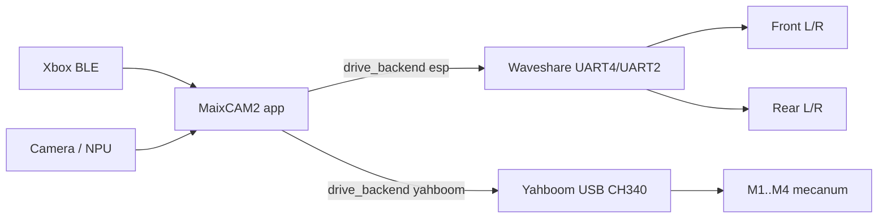
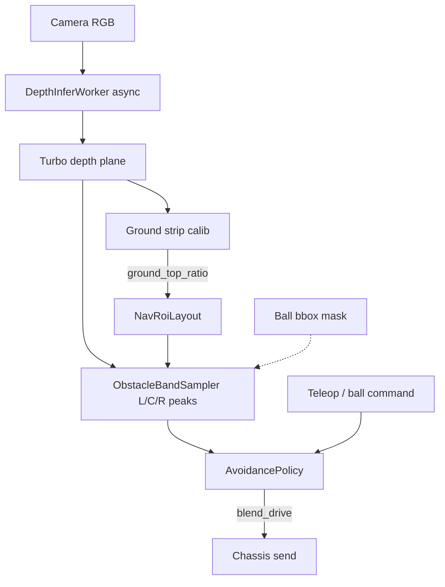

# Architecture

```mermaid
flowchart LR
  Xbox[Xbox BLE] --> Maix[MaixCAM2 app]
  Cam[Camera / NPU] --> Maix
  Maix -->|drive_backend esp| EspPath[Waveshare UART4/UART2]
  Maix -->|drive_backend yahboom| Yah[Yahboom USB CH340]
  EspPath --> Front[Front L/R]
  EspPath --> Rear[Rear L/R]
  Yah --> AllFour[M1..M4 mecanum]
```

## Drive backends

| `drive_backend` | Hardware | Link | Notes |
|-----------------|----------|------|-------|
| **`esp`** | Waveshare ESP32 ×1–2 | UART4 / UART2 (IO4/IO5) | PID on ESP; wheel setpoints |
| **`yahboom`** (shipped default) | Yahboom ROS STM32 | USB Micro (CH340) | Closed-loop `set_car_motion` (encoders + PID on board) |

ESP path: `WheelDrivePort`. Yahboom path: `ChassisMotionPort` (body velocity, not PWM). Factory: [`MotionStackFactory`](../maixcam/roverMecanum/lib/motion/motion_stack_factory.py). Details: [`docs/yahboom.md`](yahboom.md).

Waveshare ESP firmware stays a separate reusable project under `esp32/rover_coordinator/`.

## Roles (ESP path)

| Node | Responsibility |
|------|----------------|
| **MaixCAM2** | Xbox, HUD, detection, **mecanum mix**, strategy; sends wheel setpoints |
| **Waveshare front** | FL/FR (TB6612 + PID), failsafe, OTA `maixairover-front`, sensors |
| **Waveshare rear** | RL/RR (same firmware), OTA `maixairover-rear`, sensors; STS servos later |

Same `rover_coordinator` binary family on both boards (each drives local `m1/m2`). Live drive: `MecanumMixer` → `DualBoardDrivePort` → two `EspLinkPump`s → binary `SPEED`.

Hiwonder I2C path is **dropped**.

## Link Maix ↔ ESP

| Board | Maix UART | Waveshare pins | OTA hostname | IP (devices.json) |
|-------|-----------|----------------|--------------|-------------------|
| Front | UART4 A21/A22 | aux IO4/IO5 | `maixairover-front` | `192.168.20.148` |
| Rear | UART2 B0/B1 | aux IO4/IO5 | `maixairover-rear` | after first USB flash |

Backup: Maix USB Host → CP210x (`EspUsbClient`) per board.

### Protocols

| Mode | Use |
|------|-----|
| **Text lines** | Human Serial/WiFi console |
| **Binary frames** | Teleop + DBG: `SYNC=0xA5` … `PING/STOP/SPEED/PWM/TELEM` |

`TELEM` = encoders + INA219 + QMI8658 + AK09918 when present. HUD instruments use **front** TELEM for now.

### Servos (later)

Six STS servos (3 camera + 3 TOF): one bus per Waveshare. Maix will forward UART servo frames; mapping lives in `config.json`. Not implemented yet.

## Drive modes (Xbox SELECT)

Cycle: **MANUAL → AVOID → FOLLOW → MANUAL**. LED under the exit pad: grey / yellow / green|red.

| Mode | Sticks | DepthAnything | Soft avoid | Ball track |
|------|--------|---------------|------------|------------|
| **MANUAL** | Teleop | Off (no NN load cost after unload path; no submit) | Off | Off |
| **AVOID** | Teleop | On (async) | On (strafe-first) | Off |
| **FOLLOW** | Replaced by policy | On | On (default) | On |

Default after connect is **MANUAL** so teleop stays fluid. Ground-split calib still forces a depth pass while open.

Code: [`DriveMode`](../maixcam/roverMecanum/lib/app/drive_mode.py), [`BallFollowRuntime`](../maixcam/roverMecanum/lib/ball_follow/ball_follow_runtime.py).

## Obstacle detection and avoidance

Camera is tilted down. DepthAnything turbo colormap is treated as **warmth** `(R−B)/255`, not meters: red/orange = closer.

```mermaid
flowchart TB
  RGB[Camera RGB] --> Worker[DepthInferWorker async]
  Worker --> Turbo[Turbo depth plane]
  Turbo --> Ground[Ground strip calib]
  Turbo --> Sampler[ObstacleBandSampler L/C/R peaks]
  Ground -->|ground_top_ratio| ROI[NavRoiLayout]
  ROI --> Sampler
  Ball[Ball bbox mask] -.-> Sampler
  Sampler --> Policy[AvoidancePolicy]
  Sticks[Teleop / ball command] --> Policy
  Policy -->|blend_drive| Chassis[Chassis send]
```

### ROI

[`NavRoiLayout`](../maixcam/roverMecanum/lib/obstacle_nav/nav_roi_layout.py) splits the frame:

- **Below** `ground_top_ratio` → floor (ignored for dodge; ball lives here)
- **Obstacle band** between `obstacle_top_ratio` and the ground line, nearly full width (`obstacle_left/right_ratio`)

Ground line is proposed after IMU calib (`depth_ground_calib`): sample green floor peak, stick-nudge, confirm with **A**.

### L / C / R bands

[`ObstacleBandSampler`](../maixcam/roverMecanum/lib/obstacle_nav/obstacle_band_sampler.py) grids the obstacle band into ``obstacle_band_count`` vertical columns (default **5**) and takes the **top-3 mean** warmth per column. That sits between full-band mean (too timid) and raw peak (twitchy). Ball bbox is masked so the chase target is not treated as an obstacle.

### Avoidance strategy (v0)

[`AvoidancePolicy`](../maixcam/roverMecanum/lib/obstacle_nav/avoidance_policy.py) soft-blends stick (or ball) drive:

1. **Corridor** — sides hot, center cool → keep forward (no panic reverse)
2. Center hot → **strafe** toward the cooler side; stop forward
3. One side hot → strafe away
4. All columns hot → **reverse**
5. Center only caution → soft stop-forward / light bias

HUD: red/orange L/C/R zones + dodge vector when AVOID/FOLLOW and armed. Details and tunables: [`docs/obstacle_nav.md`](obstacle_nav.md).

### Failsafe (IMU)

Stuck detector (tip / crash) is independent of depth. **Attitude tip cuts drive**; other levels are HUD-only for now.

## Sensors / navigation

| Sensor | Teleop now | Later nav |
|--------|------------|-----------|
| **AK09918 mag** (ESP) | HUD heading | Absolute yaw reference |
| **QMI8658 IMU** (ESP) | HUD pitch/roll | Fuse with mag |
| **Yahboom IMU** | HUD pitch/roll/yaw via auto-report | Same |
| **DepthAnything** | AVOID / FOLLOW bands | Planner / orbit |

## ESP (`esp32/rover_coordinator/`)

FreeRTOS: **cmd**, **drive** (100 Hz PID + feed-forward), **wifi**. Each board uses `SPEED`/`PWM` **fl/fr** for its local pair.

Flash: `.\tools\flash_esp_coordinator.ps1 -Board front|rear|both` (USB or `-Ota`). IPs in [`esp32/rover_coordinator/devices.json`](../esp32/rover_coordinator/devices.json).

See `docs/wiring.md` and `docs/yahboom.md`.
