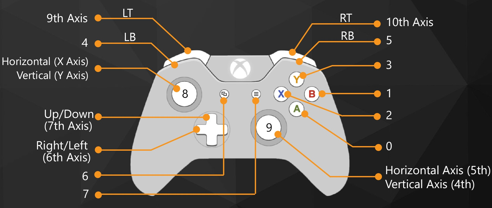

# Xbox controls

Default mapping matches the previous Keyestudio mecanum rover (revision 4).

| Input | Action |
|-------|--------|
| Left stick Y | Forward / reverse |
| **LT** | **Crab left** (strafe) |
| **RT** | **Crab right** (strafe) |
| Right stick X | Spin in place |
| Left stick X | Pivot / yaw blend |
| D-pad | Full-axis presets (incl. diagonals) |
| LB / RB | Decrease / increase session max speed |
| A | Stop |
| **View / Select** | Toggle **ball-follow** mode |
| **Menu / Start** | Cycle ball color (green ↔ red) |

Strafe comes from `trigger_diff` = RT − LT (both pressed → cancel). Config: `mapping.axes.drive_strafe`.

## Ball-follow

When enabled (View), sticks are overridden: vision drives `forward` + `spin` only via the active backend (`set_car_motion` on Yahboom). Stick/trigger gauges hide while following; a colour LED (grey=manual, green/red=follow) shows the active mode.

**Follow = hold a formation.** Spin to center X and servo forward/back on image **Y** together. Setpoint ``target_center_y_ratio`` ≈ **0.50** (mid-frame): ball too high → approach, too low → retreat, in a ±``target_y_tolerance_ratio`` deadzone → stop. Spin scales with X error (`align_spin_curve` ease-out) and sideways velocity (`align_spin_velocity_boost`) so a ball leaving the crosshair is chased harder. Blob height is safety only (oversized). Hard bottom edge ``too_close_center_y_ratio`` (~0.90) is emergency reverse. Lost at/below the Y setpoint → immediate retreat (no wait).

Approach soft-cap / search yaw clamps live under `config.json` → `ball_follow`.

LAB blob colours live only under `ball_follow.colors` in `config.json` (and `color_order` for Start cycling). Encoder closed-loop allows low `min_*_axis` trim (no Keyestudio-style high breakaway).

Optional `ball_follow.depth_fusion_enabled`: DepthAnything runs **async** (one frame in flight; HUD stays fluid). Ball detect/track/drive are independent — depth busy only freezes the last distance band. `depth_view`: `blend` / `depth` / `rgb`. `depth_interval_ms` can be low (e.g. 50) in `depth` mode. `depth_contour_thickness` dilates Canny edges (1–4). Display only — approach distance still uses blob size, not depth.

## Mecanum body velocities (Yahboom `set_car_motion`)

| Axis | Meaning | How you get it |
|------|---------|----------------|
| **vx** | Forward / reverse | Left stick Y |
| **vy** | **Crab** (strafe sideways) | **LT / RT** (`trigger_diff`) |
| **vz** | Spin in place (yaw) | Right stick X (+ left X as pivot blend) |

- **Diagonal**: D-pad corners (`diag_fl` …) → `vx` + `vy` together. Same if you hold forward stick + a trigger.
- **Drift-like**: hold Left Y (vx) + Right X (vz) — the STM32 mixes mecanum; no separate “drift mode” API.
- **Speed %**: `yahboom.max_vx/vy/vz` are the physical ceilings (m/s, rad/s). LB/RB change `session_max_speed` 0…255, which scales all three: `v = axis × max_v × (speed/255)`.

Maix `config.json` already mirrors Keyestudio: triggers=crab, D-pad diagonals, right stick=spin, left X=pivot.

With `drive_backend=yahboom`, Maix does **not** run `MecanumMixer`. Flow:

1. Stick mapping → `DriveCommand` (forward / strafe / spin)
2. `DriveCommandChassisMapper` → body velocity `vx, vy, vz` (m/s, rad/s)
3. USB `set_car_motion` → **STM32** mixes mecanum + **closed-loop PID on encoders**

So yes: motion uses encoders. Open-loop `set_motor` PWM is only for the USB bench tool.

Yahboom frame: `+vx` forward, `+vy` left, `+vz` CCW — mapper negates forward, strafe and spin. Requires motor wiring M1=FL, M2=RL, M3=FR, M4=RR (see `docs/yahboom.md`).

## HUD (connected)

Once Xbox is paired/connected, the camera overlay shows:

- Left / right stick gauges
- LT / RT bars
- D-pad dots
- A / B / X / Y cluster (lit when pressed)
- Speed bar with LB / RB highlight
- Dual battery bars (CAM % / ROV %)
- DISC to disconnect

Disconnected: PAIR + CONNECT only (no on-screen motor pad).
