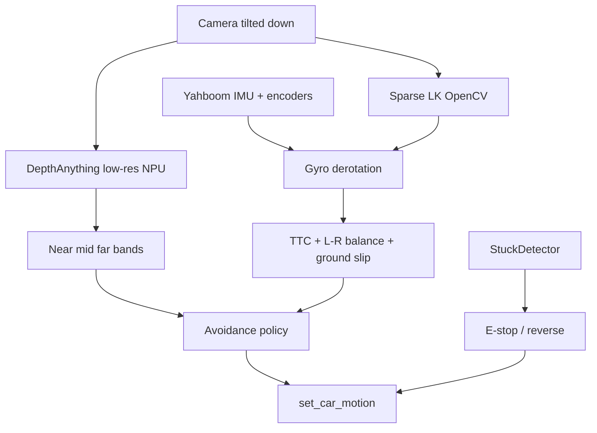

# Action plan — navigation without ToF / LiDAR

Sensor-poor autonomy for MaixAiRover (Yahboom mecanum + MaixCAM2). Camera is **tilted toward the ground** (ball on floor, sometimes held by hand): lower FOV = ground + ball, mid FOV = near obstacles.

## Locked roles

| Layer | Sensor / module | Job |
| --- | --- | --- |
| Primary obstacles | DepthAnything turbo **colors** (not meters) | red/orange = avoid; yellow = caution; blue/black = far |
| Ground strip | Lower FOV (tilted cam) | calib of vertical limits; **never** treated as obstacle |
| Ball mask | Ball bbox (follow) | exclude from “near obstacle” so the ball is not an avoid target |
| Secondary cues | Sparse optical flow (OpenCV LK) + gyro derotation | ground slip vs encoders; TTC; left/right balance |
| Failsafe | IMU stuck detector ([obstacle_nav.md](obstacle_nav.md)) | tip / violent crash |
| Later | Local occupancy + DWA; ToF/LiDAR when available | real planner — not a prerequisite |

### Depth colors (no metric LUT)

DepthAnything is relative (scene scales when an arm enters the FOV). We **do not** need cm. Use turbo warmth bands only:

- **Red / orange** → obstacle to dodge (legs, walls, furniture when close)
- **Yellow** → mid range → slow / prepare
- **Green** on the lower horizontal wash → typical **floor** under tilt (use for limit placement)
- **Blue / dark** → far / free

### Two vertical bands (tilted cam)

```text
┌─────────────────────────────┐
│  far / sky-ish (ignore)     │
│  OBSTACLE band (L|C|R)      │  ← red/orange here = dodge
│  ─ green floor split ─      │  ← calib sets this Y
│  GROUND strip (ignore avoid)│  ← ball lives here; mask it
└─────────────────────────────┘
```

Floor strip sets `ground_top` / obstacle bottom after IMU (extra Xbox step). Obstacle decisions use **only** the band **above** that split.

### Avoidance policy v0 (manual + follow)

Same cue, two presentations:

| Mode | Presentation | Action |
| --- | --- | --- |
| Manual | Big HUD arrow / vector | Soft override: center-near → stop/short reverse; L/R-near → strafe/spin to free side |
| Ball-follow | Same override fused into drive | Keep ball track; prefer **lateral strafe** first (mecanum) |

**Orbit vs strafe (locked default):** strafe/spin to the freer side first. Orbit around an obstacle only if (a) both sides blocked in the obstacle band, or (b) lateral would lose the ball from FOV — then short reverse + yaw toward free + reacquire. No planner yet.



## Execution order

1. **IMU failsafe** — tip cuts drive; heading hold when driving straight (drift).
2. **Depth ROI + near mask** — blue corridor + orange cells (done); ground green line for tilt.
3. **Depth ground calib (after IMU)** — optional wizard step: sample floor strip while still; propose `ground_top` from cool transition; confirm with **Xbox A** / Skip keeps ratios. (wired)
4. **Avoidance v0** — L/C/R warmth in obstacle band only (ball masked); HUD arrow in manual; same override in follow (strafe-first). (wired)
5. **Sparse OF + gyro** — LK ~320×240; derotate; ground strip slip + obstacle strip TTC / L-R fused with depth.
6. **Planner later** — local grid + DWA only after bands + v0 work. ToF/LiDAR is an upgrade, not a blocker.

## Out of scope now

- Pure nadir camera mount
- Soft-impact / slip IMU without TCP evidence
- On-device VLM for avoidance
- Requiring ToF/LiDAR

## Quality bar

Unchanged: SOLID, 1 class/file, dataclasses, no getattr, host-testable core, no silent `except: pass` ([`tests/test_code_guardrails.py`](../tests/test_code_guardrails.py)). See `AGENTS.md`.
